# ft_transcendence

The last project of the 42 School's common core. 
The main goal is to create a Single Page Application where users can log, register, interact with each other via live chat, and most importantly play against each other at the famous 1970's Pong Game !  

## Final Grade
### ------------------------------------------------------------------------   $\textcolor{lime}{\textsf{125/100}}$    ------------------------------------------------------------------------ 
### ------------------------------------------------------------------------   ⭐  ⭐  ⭐   ------------------------------------------------------------------------ 

# Completed Modules

Web
| Importance | Description                                | Status |
|------------|--------------------------------------------|:------:|
| Major      | Usage of a framework to build Backend      |   ✅   |
| Major      | Store the score of a tournament in the Blockchain |   ❌   |
| Minor      | Usage of a Database                       |   ✅   |
| Minor      | Usage of a framework to build Frontend     |   ✅   |

User Management
| Importance | Description                                | Status |
|------------|--------------------------------------------|:------:|
| Major      | Standard user management, authentication, users across tournaments |   ✅   |
| Major      | Implementing a remote authentication       |   ✅   |

Gameplay and UX
| Importance | Description                                | Status |
|------------|--------------------------------------------|:------:|
| Major      | Remote players                             |   ✅   |
| Major      | Multiplayer (> 2 in the same game)         |   ❌   |
| Major      | Make another game with matchmaking         |   ❌   |
| Major      | Live Chat                                  |   ✅   |
| Minor      | Customize games                            |   ✅   |

AI and Algorithm
| Importance | Description                                | Status |
|------------|--------------------------------------------|:------:|
| Major      | AI Opponent                                |   ✅   |
| Minor      | Dashboard with game statistics             |   ✅   |

Cybersecurity
| Importance | Description                                | Status |
|------------|--------------------------------------------|:------:|
| Major      | Implement Modsecurity and HashiCorp Vault  |   ✅   |
| Major      | Implement 2FA and JWT                      |   ✅   |
| Minor      | GDPR Compliance: anonymization, data management and account deletion |   ✅   |

DevOps
| Importance | Description                                | Status |
|------------|--------------------------------------------|:------:|
| Major      | Infrastructure setup for log management    |   🟧   |
| Major      | Backend as microservices                   |   🟧   |
| Minor      | Monitoring system                          |   ✅   |

Graphics
| Importance | Description                                | Status |
|------------|--------------------------------------------|:------:|
| Major      | Use of advanced 3D techniques              |   ❌   |

Accessibility
| Importance | Description                                | Status |
|------------|--------------------------------------------|:------:|
| Minor      | Support on all devices                     |   🟧   |
| Minor      | Expanding browser compatibility            |   ✅   |
| Minor      | Multiple language support                  |   ✅   |
| Minor      | Add accessibility for visually impaired users |   ❌   |
| Minor      | Server Side Rendering (SSR) Integration    |   ✅   |

Server Side Pong
| Importance | Description                                | Status |
|------------|--------------------------------------------|:------:|
| Major      | Implement an API and make Server Side Pong |   ✅   |
| Major      | Pong Gameplay via CLI                      |   ❌   |

# Screenshots

|  |
| - |

| 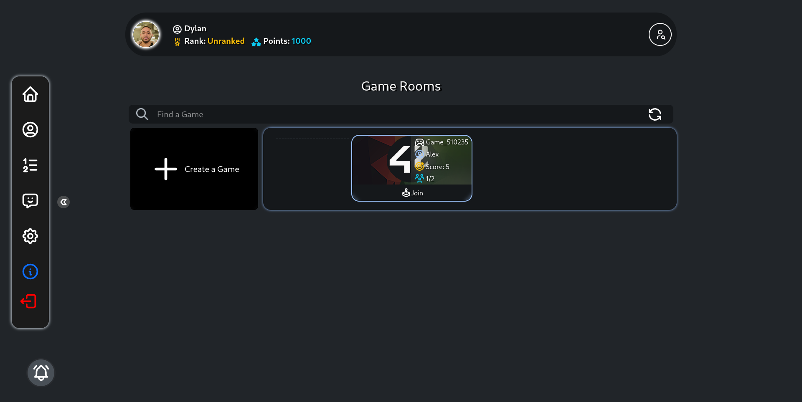 |
| - |

| 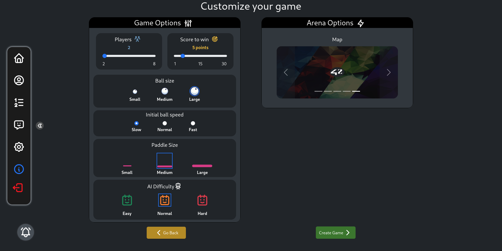 |
| - |

| 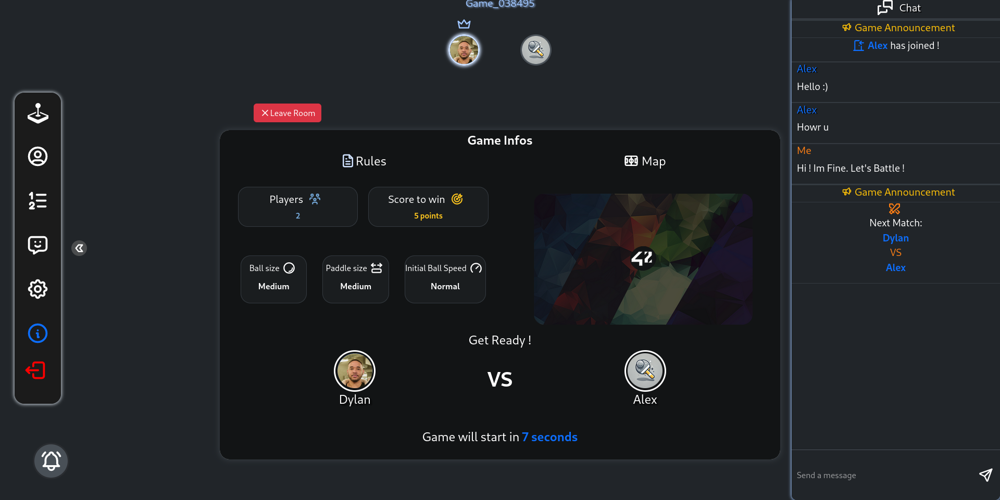 |
| - |

| 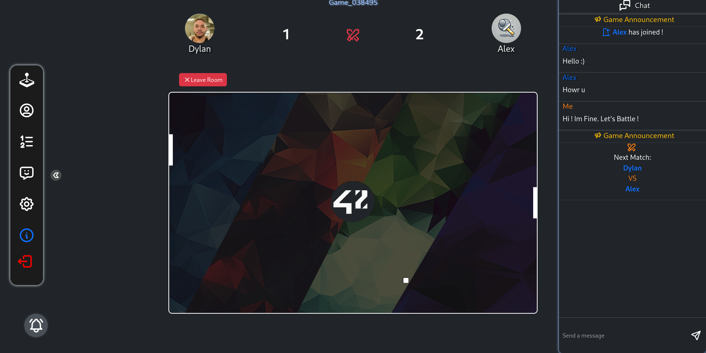 |
| - |

| 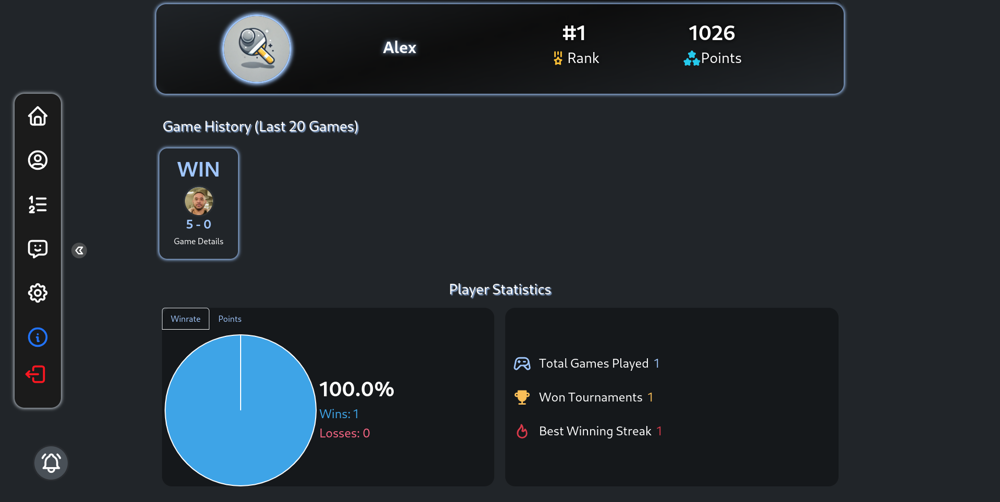 |
| - |

| 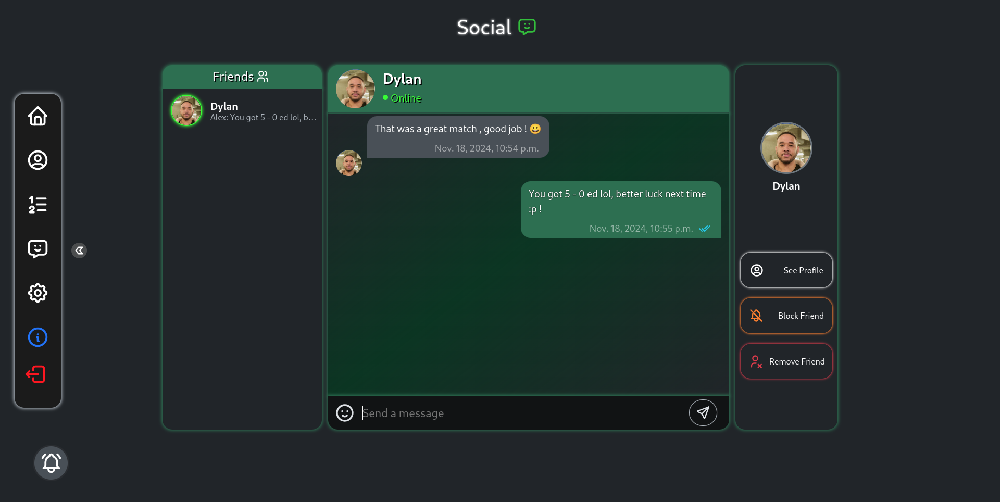 |
| - |

| 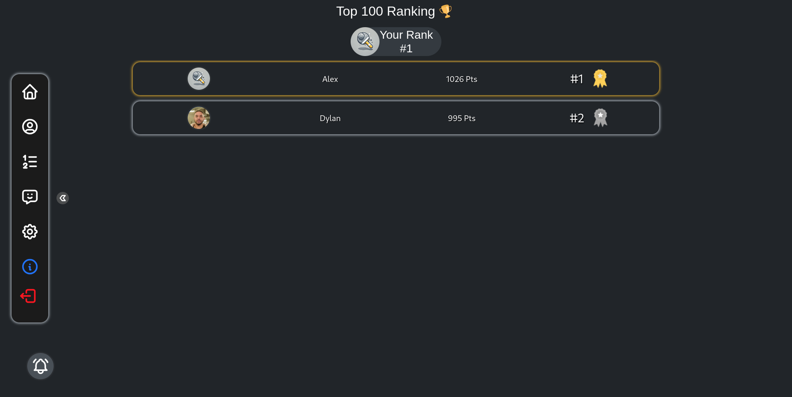 |
| - |

| 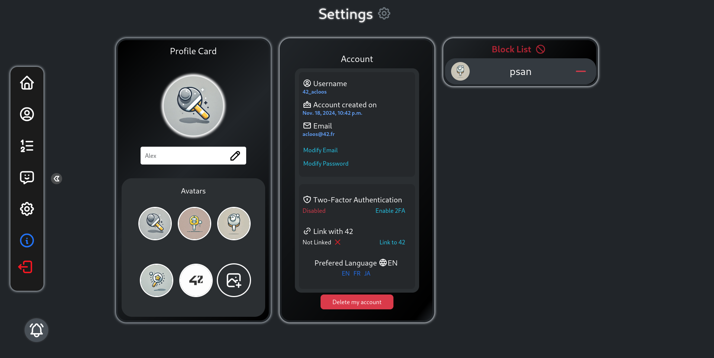 |
| - |

| 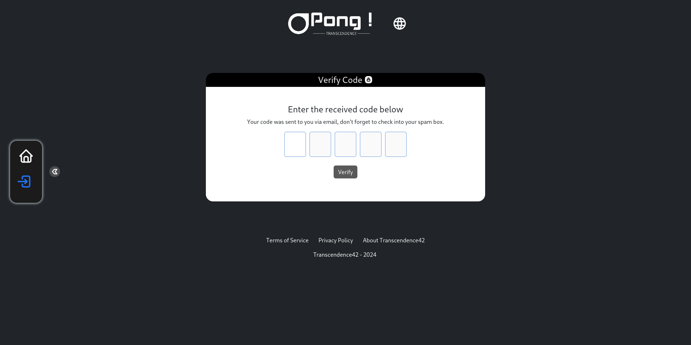 |
| - |

| 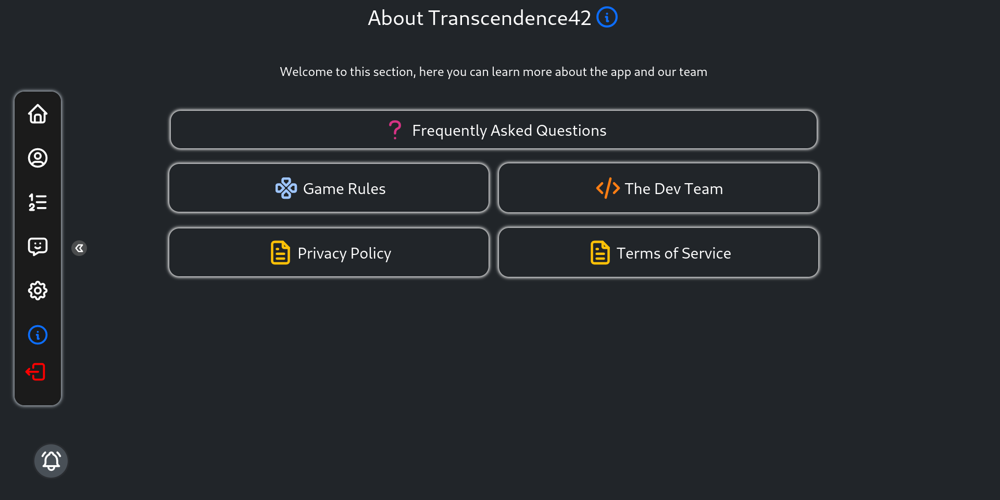 |
| - |

| 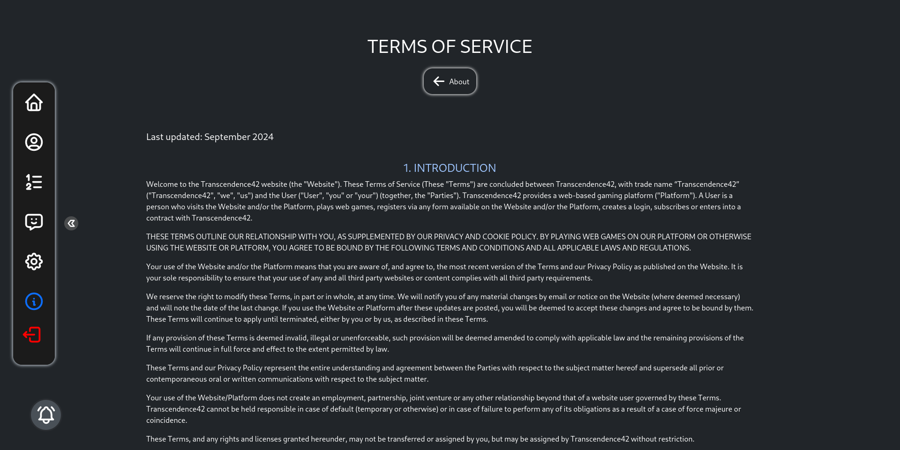 |
| - |

| 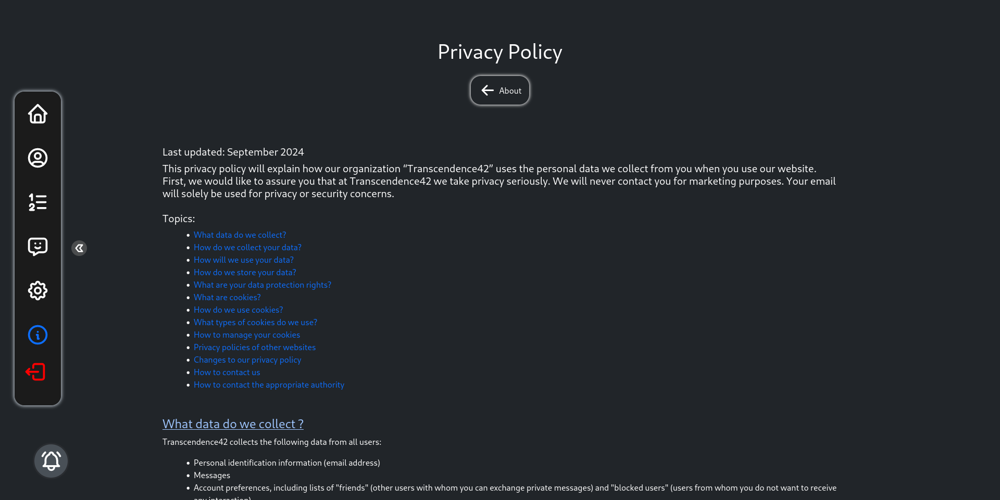 |
| - |

